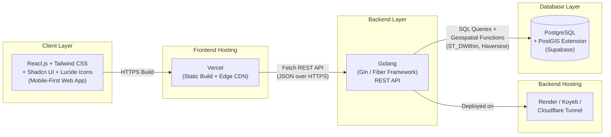

# ARCH.md — System Architecture & Mathematical Models
## ShareKampus — Technical Architecture Documentation

---

## 1. Diagram Arsitektur Monorepo

ShareKampus dibangun dengan pendekatan **Monorepo** (`/frontend` dan `/backend` dalam satu repositori Git) untuk mempermudah koordinasi tim kecil (4 orang) dalam tenggat 15 hari.

### 1.1 Alasan Pemilihan Stack

| Layer | Teknologi | Alasan |
|-------|-----------|--------|
| Frontend | React.js + Tailwind + Shadcn UI | Kecepatan development komponen UI standar (bottom sheet, badge, card) tanpa membangun dari nol; Tailwind mempercepat implementasi Design System. |
| Backend | Golang (Gin/Fiber) | Performa tinggi untuk kueri geospasial yang sering dipanggil (katalog nearby items), concurrency native Go cocok untuk beban request paralel saat demo. |
| Database | PostgreSQL + PostGIS (Supabase) | PostGIS menyediakan fungsi geospasial siap pakai (`ST_DWithin`, `ST_Distance`) sehingga tidak perlu implementasi Haversine manual di level aplikasi; Supabase mempercepat provisioning DB + Auth dasar. |
| Hosting | Vercel (FE) + Render/Koyeb (BE) | Free-tier yang stabil untuk kebutuhan demo kompetisi, deploy otomatis dari Git push. |

---

## 2. Formulasi Matematika — Haversine Distance (Geofencing)

Untuk menentukan jarak antara dua titik koordinat (lokasi pengguna dan lokasi barang/kampus) di permukaan bumi, digunakan **Haversine Formula**:

$$a = \sin^2\left(\frac{\Delta\varphi}{2}\right) + \cos(\varphi_1) \cdot \cos(\varphi_2) \cdot \sin^2\left(\frac{\Delta\lambda}{2}\right)$$

$$d = 2r \cdot \arcsin\left(\sqrt{a}\right)$$

**Keterangan:**
- $\varphi_1, \varphi_2$ = latitude titik 1 dan titik 2 (dalam radian)
- $\Delta\varphi$ = selisih latitude ($\varphi_2 - \varphi_1$)
- $\Delta\lambda$ = selisih longitude ($\lambda_2 - \lambda_1$)
- $r$ = radius bumi rata-rata = 6.371 km
- $d$ = jarak antar dua titik (km)

**Implementasi Praktis:** ShareKampus tidak menghitung Haversine secara manual di kode aplikasi, melainkan memanfaatkan fungsi bawaan PostGIS `ST_DWithin(geography, geography, radius_meter)` yang secara internal menggunakan perhitungan geodesic setara Haversine namun lebih akurat dan dioptimalkan dengan spatial index (`GIST`). Detail query lihat `ERD.sql`.

**Contoh Kasus:** Filter "barang dalam radius 2.5 km dari kampus" berarti backend menjalankan kueri dengan parameter `radius_meter = 2500` terhadap kolom geospasial `location` pada tabel `items`.

---

## 3. Formulasi Matematika — Trust Score Engine

Trust Score ($TS$) merepresentasikan reputasi pengguna dalam skala **0.00 – 100.00**, dihitung dari tiga komponen berbobot:

$$TS_i = 100 \times \left( \alpha \cdot \frac{\bar{R}_i}{5} + \beta \cdot OTR_i + \gamma \cdot CR_i \right)$$

**Keterangan:**
- $\bar{R}_i$ = rata-rata rating ulasan yang diterima pengguna $i$ (skala 1–5)
- $OTR_i$ = *On-Time Return Ratio* = (jumlah pengembalian tepat waktu) / (total transaksi selesai sebagai peminjam)
- $CR_i$ = *Completion Ratio* = (jumlah transaksi selesai/`returned`) / (jumlah transaksi diajukan/`pending`+`active`+`returned`)
- $\alpha, \beta, \gamma$ = bobot komponen, dengan $\alpha + \beta + \gamma = 1$

**Bobot default MVP:** $\alpha = 0.4$ (kualitas ulasan), $\beta = 0.4$ (ketepatan waktu — krusial untuk kepercayaan P2P), $\gamma = 0.2$ (konsistensi menyelesaikan transaksi).

**Kondisi Awal (Cold Start):** Pengguna baru tanpa riwayat transaksi diberi skor default $TS_0 = 50.00$ (netral), agar tidak diblokir dari transaksi pertama namun juga tidak diberi kepercayaan penuh secara instan.

$$TS_i = \text{clamp}(0.00,\ 100.00,\ TS_i)$$

---

## 4. Formulasi Matematika — Student Expense Saver Counter

Menghitung estimasi total nominal yang dihemat komunitas mahasiswa melalui transaksi pinjam/barter dibanding harus membeli barang baru:

$$E_{\text{saved}} = \sum_{i=1}^{n} (M_i - C_i)$$

**Keterangan:**
- $E_{\text{saved}}$ = total penghematan komunitas (Rupiah)
- $n$ = jumlah transaksi berstatus `returned` (selesai)
- $M_i$ = estimasi harga pasar barang $i$ jika dibeli baru (diinput pemilik barang saat membuat listing, field `market_price`)
- $C_i$ = biaya aktual yang dikeluarkan peminjam pada transaksi $i$ (Rp0 untuk pinjam/barter tanpa biaya tambahan; dapat > 0 jika ada kesepakatan biaya sewa kecil)

**Catatan Implementasi:** Nilai ini dihitung sebagai agregat (`SUM`) melalui query terhadap tabel `transactions` yang di-join dengan `items`, hanya menghitung transaksi berstatus `returned`. Ditampilkan real-time di beranda sebagai kartu highlight komunitas (lihat komponen "Expense Saver Counter Card" pada `DESIGN_SYSTEM.md`).
