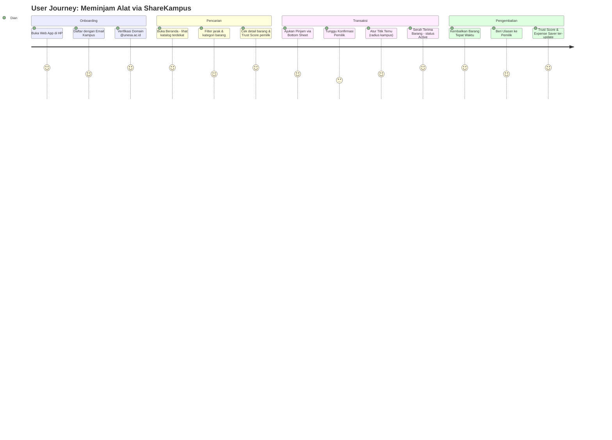

# PRD.md — Product Requirement Document
## ShareKampus — Platform Barter & Pinjam Alat/Buku Kuliah Antar-Mahasiswa

**Kompetisi:** GAYATAMA 5 International Web Technology Competition
**Durasi Eksekusi:** 15 Hari
**Versi:** 1.0 (MVP)

---

## 1. Ringkasan Eksekutif

ShareKampus adalah *Mobile-First Web Application* yang memfasilitasi mahasiswa untuk saling **meminjamkan** dan **barter** alat/buku kuliah yang sifatnya *idle asset* — barang yang dibeli mahal namun hanya dipakai dalam periode singkat (jas laboratorium, buku teks semesteran, kalkulator ilmiah, adapter/kabel khusus). Platform ini menggunakan *Location-Based Services* dengan radius kampus (2.5 km) untuk memastikan transaksi terjadi antar mahasiswa yang secara fisik saling dekat, serta *Campus SSO* untuk memverifikasi identitas pengguna sebagai mahasiswa aktif.

### 1.1 Penyelarasan dengan Sustainable Development Goals (SDGs)

| SDG | Kontribusi ShareKampus |
|-----|------------------------|
| **SDG 12 — Konsumsi dan Produksi Bertanggung Jawab** | Mendorong ekonomi sirkular di lingkungan kampus: barang praktikum/kuliah yang menganggur dapat dipakai ulang oleh mahasiswa lain, mengurangi konsumsi barang baru dan limbah barang yang jarang dipakai. |
| **SDG 4 — Pendidikan Berkualitas** | Memperluas akses sarana belajar (buku, alat praktikum) bagi mahasiswa dengan kemampuan ekonomi terbatas, tanpa harus membeli barang baru dengan harga penuh — memeratakan kesempatan belajar. |

### 1.2 Masalah Empiris

Mahasiswa secara rutin membeli barang perkuliahan dengan harga tinggi yang hanya dipakai satu semester atau bahkan satu praktikum (jas lab, kalkulator scientific, buku wajib mata kuliah tertentu). Setelah masa pakai selesai, barang tersebut menjadi *idle asset* — tersimpan tanpa nilai guna lanjutan — padahal mahasiswa lain di angkatan/kampus yang sama justru sedang membutuhkannya. Tidak ada platform khusus yang mempertemukan kebutuhan ini secara aman (terverifikasi sesama mahasiswa) dan berbasis lokasi (dekat kampus, mudah serah-terima).

---

## 2. User Persona & User Journey

### 2.1 Matriks User Persona

| Persona | Deskripsi | Kebutuhan Utama | Pain Point Saat Ini |
|---------|-----------|------------------|----------------------|
| **Dian — Peminjam Aktif** | Mahasiswa semester 3, butuh jas lab untuk satu semester praktikum | Akses cepat ke alat murah/gratis, dekat kampus, dapat dipercaya | Harus beli baru seharga penuh untuk pemakaian sementara |
| **Bagas — Pemilik Idle Asset** | Mahasiswa semester 7, punya kalkulator & buku semester lalu yang menganggur | Cara mudah menyalurkan barang tak terpakai, dapat imbalan/barter, membangun reputasi | Barang menumpuk, tidak ada marketplace khusus mahasiswa terverifikasi |
| **Sari — Mahasiswa Baru Skeptis** | Mahasiswa baru, ragu bertransaksi dengan orang tak dikenal secara online | Jaminan keamanan/verifikasi identitas kampus, riwayat transaksi transparan | Takut penipuan di marketplace umum (OLX, grup Facebook) |

### 2.2 User Journey (Mobile Flow) — Alur Peminjaman

---

## 3. Kebutuhan Fungsional (Functional Requirements)

### FR-01 — Campus SSO & Trust Score Engine
- Registrasi/login wajib menggunakan email domain kampus resmi (contoh: `@unesa.ac.id`, pola umum `@*.ac.id`), divalidasi via regex + (opsional) verifikasi tautan konfirmasi email.
- Sistem menghitung **Reputation & Trust Score** (skala 0.00–100.00) secara otomatis berdasarkan: rata-rata rating ulasan, rasio pengembalian tepat waktu, dan rasio penyelesaian transaksi.
- Skor ditampilkan di profil pengguna dan di setiap kartu barang yang ia unggah.

### FR-02 — Geofencing Micro-Lending & Barter Hub
- Katalog barang ditampilkan berdasarkan jarak terdekat dari lokasi pengguna, dibatasi radius default **2.5 km** dari titik kampus (dapat diperluas manual oleh pengguna).
- Menggunakan fungsi geospasial PostGIS (`ST_DWithin`, Haversine) untuk kueri lokasi.
- Filter kategori (buku, alat lab, elektronik, lainnya) dan tipe transaksi (pinjam/barter).

### FR-03 — P2P Borrowing & Barter Transaction Engine
- Pengajuan transaksi pinjam atau barter antar dua mahasiswa.
- Siklus status transaksi: `pending` → `active` → `returned` (atau `overdue` jika melewati batas waktu pengembalian yang disepakati).
- Notifikasi in-app untuk setiap perubahan status.
- Kedua pihak dapat memberi ulasan setelah transaksi berstatus `returned`.

### FR-04 — Student Expense Saver Counter
- Kalkulator agregat komunitas yang menghitung total nominal yang berhasil dihemat mahasiswa melalui platform:

  $$E_{\text{saved}} = \sum_{i=1}^{n} (M_i - C_i)$$

  di mana $M_i$ = harga pasar barang jika dibeli baru, dan $C_i$ = biaya aktual yang dikeluarkan peminjam (Rp0 untuk pinjam/barter penuh).
- Ditampilkan sebagai kartu highlight di beranda sebagai *social proof* dampak sosial platform (mendukung narasi SDG 12 di proposal).

---

## 4. Kebutuhan Non-Fungsional (Non-Functional Requirements)

| Kategori | Kebutuhan |
|----------|-----------|
| **Performance** | Respons API rata-rata < 300ms untuk kueri katalog (didukung Golang + index geospasial PostGIS). Waktu render halaman awal (First Contentful Paint) < 2 detik di jaringan 4G. |
| **Security** | JWT untuk autentikasi sesi. Validasi domain email kampus di sisi backend (bukan hanya frontend). Row Level Security (RLS) Supabase untuk mencegah akses data lintas pengguna. Tidak ada API key/secret yang ter-expose di kode frontend. |
| **Reliability** | Uptime backend ditargetkan ≥ 99% selama masa demo/penjurian. Penanganan error yang konsisten (format error JSON terstandar, lihat `API_CONTRACT.md`). Validasi input di setiap endpoint untuk mencegah data korup. |
| **Usability** | UI mobile-first, dioptimalkan untuk layar 375–414px, navigasi utama via Bottom Navigation Bar (maksimal 1-2 tap untuk aksi utama). |
| **Scalability (non-prioritas MVP)** | Struktur database dan API dirancang agar mudah diperluas ke multi-kampus di fase pasca-MVP. |

---

## 5. Batasan Scope MVP (15 Hari)

### Termasuk dalam Scope MVP
- Registrasi/login dengan validasi domain email kampus (tanpa OAuth pihak ketiga, cukup validasi domain + password).
- Katalog barang dengan filter radius geospasial dan kategori.
- Alur pengajuan dan manajemen transaksi pinjam/barter (3 status inti: pending, active, returned).
- Trust Score Engine dengan formula dasar (tanpa machine learning).
- Expense Saver Counter versi agregat sederhana (dihitung dari data transaksi `returned`).
- Deploy fungsional: Frontend di Vercel, Backend di Render/Koyeb, Database di Supabase.

### Di Luar Scope MVP (Pasca-Kompetisi)
- Sistem pembayaran/deposit uang jaminan.
- Chat real-time antar pengguna (cukup kontak/notifikasi status dahulu).
- Verifikasi email dengan link konfirmasi otomatis (opsional jika waktu memungkinkan; jika tidak, validasi format domain sudah cukup untuk demo).
- Aplikasi native (Android/iOS) — cukup web app responsif.
- Sistem rekomendasi berbasis AI/ML untuk trust score atau matching barang.
- Multi-kampus (MVP fokus 1 kampus contoh: UNESA).
